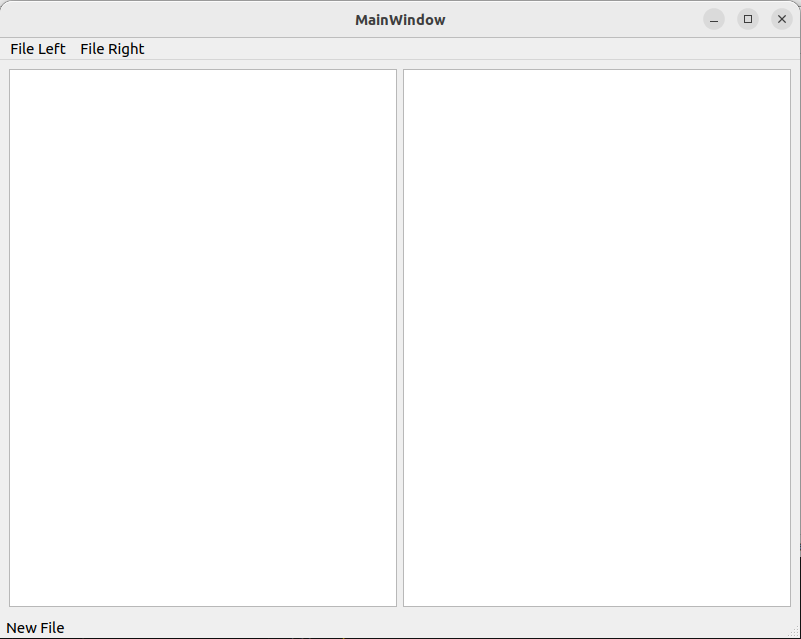

# Autorzy
- Marcin Łobacz
- Aleksandr Rahacheusk

# ZPR - Porównywanie plików tekstowych

Stworzyliśmy szkielet narzędzia. Aplikacja ma możliwość wczytywania, modyfikowania i zapisywania plików.

Proces budowania został zautomatyzowany. Dodaliśmy także automatyczną generacje dokumentacji - doxygen.

Ponadto wykonaliśmy przykładowe testy jednostkowe.


## Podgląd aplikacji


## Budowanie

Do budowania potrzebny jest cmake, doxygen, boost, openssl, qt6.

Mając świeżą instalację Ubuntu 22.04 musimy wykonać komendę: <br>
    - sudo apt-get install qt6-base-dev libgl1-mesa-dev libboost-test-dev doxygen libssl-dev  g++ cmake

### Kompilacja

```
mkdir build && cd build
cmake ..
make
make docs <- tworzenie dokumentacji
```
Dokumentacja po kompilacji znajduje się w folerze docs.

### Uruchomienie
Aplikacja - ```cd src && ./ZPR```

Test jednostkowe - ```cd tests && ./MyTests```